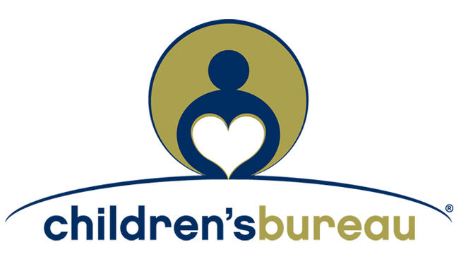

# State of the Child Region 5: Antelope Valley

  
Table of Contents

  <ol>
    <li>
      <a href="#about-the-project">About The Project</a></li>
    <li><a href="#data">Data</a></li>
    <li><a href="#about-catalyst-california">About Catalyst California</a>
      <ul>
        <li><a href="#our-vision">Our Vision</a></li>
        <li><a href="#our-mission">Our Mission</a></li>
      </ul>
    </li>
    <li><a href="#contributors">Contributors</a></li>    
    <li><a href="#partners">Partners</a></li>
    <li><a href="#contact-us">Contact Us</a></li>
    <li><a href="#license">License</a></li>
  </ol>

## About The Project

This report presents findings on the state of children and public systems in the Antelope Valley. It represents the most comprehensive analysis of data from the Antelope Valley region to date. The Children’s Bureau commissioned it to understand the state of children in the Antelope Valley, identify indicators to monitor, and increase the amount of data available to advocates. We hope that county agencies, funders, and other partners use this report to learn more about the Antelope Valley and engage with Antelope Valley communities in their work. Catalyst California partnered with the Children’s Bureau to ask over 100 residents and advocates for recommendations on what issues to consider, positive examples of programs to uplift, and data to include in the report. Their recommendations shape the content gathered for this report and were reviewed and approved by a steering committee of 20 community experts. 

The State of the Child Antelope Valley Report seeks to understand the conditions of children and families within this current moment in the Antelope Valley, California Best Start Region 5. It encompasses topics including demographics, education, economic well being, etc.

<li><a href="https://catalystcalifornia.github.io/State_of_the_Child_Region_5/findings_visuals_draft.html">Draft Findings and Visuals</a></li>
<li><a href="">English Report</a></li>
<li><a href="">Informe en Español</a></li>

(<a href="#top">back to top</a>)

## Data

#### Education Indicators
<ul>
  <li><a href="R_Scripts/ela.R">3rd Grade English Language Arts Proficiency Rates</a></li>  
  <li><a href="R_Scripts/math.R">3rd Grade Math Proficiency Rates</a></li>
  <li><a href="R_Scripts/ell.R">English Language Learners Rates</a></li>
  <li><a href="R_Scripts/hs_grad.R">High School Graduation Rates</a></li>
  <li><a href="R_Scripts/socioeconomically_disadvantaged.R">Socioeconomically Disadvantaged Rates</a></li>
  <li><a href="R_Scripts/suspension.R">Suspension Rates</a></li>  
  <li><a href="R_Scripts/student_homelessness.R">Youth Experiencing Homelessness Rates</a></li>  
  <li><a href="R_Scripts/non-binary.R">Youth Identifying as Non-Binary Rates</a></li>  
  <li><a href="R_Scripts/foster.R">Youth in Foster Care Rates</a></li>
  <li><a href="R_Scripts/migrant.R">Youth in Migrant Program Rates</a></li>
  <li><a href="R_Scripts/disabilities.R">Youth with Disabilities Rates</a></li> 
</ul>

#### Demographic Indicators
<ul>
  <li><a href="R_Scripts/age.R">Ages in the Antelope Valley</a></li>  
    <li><a href="R_Scripts/under18_by_race.R">Children by Race</a></li>  
  <li><a href="R_Scripts/language.R">Language Spoken at Home for Antelope Valley geographies, 2020</a></li>
  <li><a href="R_Scripts/language_entire_av.R">Languages in SPA 1</a></li>
  <li><a href="R_Scripts/population.R">Population</a></li>
  <li><a href="R_Scripts/population_change.R">Population Change</a></li>
  <li><a href="R_Scripts/race.R">Race</a></li>
  <li><a href="R_Scripts/race_entire_av.R">Race in SPA 1</a></li>
</ul>

#### Economic Indicators
<ul>
  <li><a href="R_Scripts/cost_of_living.R">Cost of Living</a></li>
  <li><a href="R_Scripts/eviction.R">Evictions</a></li>
  <li><a href="R_Scripts/foreclosure.R">Foreclosures</a></li>
  <li><a href="R_Scripts/child_welfare.R">Child Welfare</a></li>
  <li><a href="R_Scripts/food_security.R">Food Security</a></li>
  <li><a href="R_Scripts/rent_burden_totals.R">Rent Burden in the Antelope Valley</a></li>
  <li><a href="R_Scripts/homeless.R">Homelessness in the Antelope Valley</a></li>
</ul> 

#### Crime and Safety Indicators
<ul>
  <li><a href="R_Scripts/health.R">Health</a></li>
  <li><a href="R_Scripts/hate_crimes.R">Hate Crimes</a></li>
  <li><a href="R_Scripts/use_of_force.R">Use of Force</a></li>
</ul>

#### Functions for Indicator Scripts
<ul>
  <li><a href="R_Scripts/cde_functions.R">CDE Functions</a></li>
  <li><a href="R_Scripts/Tract_Wt_Avg_Functions.R">Census Tract Weighting Functions</a></li>
</ul>

#### Scripts for Creating Visuals
<ul>
  <li><a href="R_Scripts/AV_Reference_Map.R">Reference Map</a></li>
  <li><a href="R_Scripts/HPSAs_Map.R">Health Planning Service Areas Map</a></li>
  <li><a href="R_Scripts/substantiated_referrals_map.R">Reference Map</a></li>
  <li><a href="R_Scripts/av_children_by_race_chart.R">Children by Race Barchart</a></li>
  <li><a href="R_Scripts/hs_grad_chart.R">High School Graduation Barchart</a></li>
  <li><a href="R_Scripts/rcm_chart.R">Real Cost Measure Dumbbell Plot</a></li>
  <li><a href="R_Scripts/rent_chart.R">Rent Burdened Barchart</a></li>
  <li><a href="R_Scripts/staff_and_students_by_race_chart.R">Comparing Student and Staff Diversity by Race & Ethnicity Grouped Barchart</a></li>
  <li><a href="R_Scripts/static_tables.R">Static Tables</a></li>
</ul>

#### Helpful Links
<ul>
  <li><a href="F5LA_BrandGuidelines_COLORS.pdf">First 5 LA Brand Guide</a></li>
  <li><a href="https://www.census.gov/geographies/mapping-files/time-series/geo/cartographic-boundary.2020.html">Census Tracts</a></li>
  <li><a href="https://egis-lacounty.hub.arcgis.com/datasets/service-planning-areas-2022-view/explore?location=34.025999%2C-118.300941%2C8.00">Link to current Service Planning Areas</a></li>
  <li><a href="https://egis-lacounty.hub.arcgis.com/datasets/lacounty::la-county-service-planning-area-2012/explore">Previous SPAs used in comparison to 2011</a></li>
  <li><a href="https://maps.latimes.com/neighborhoods/index.html">Los Angeles Times Neighborhoods (used in reference map)</a></li>
</ul>

(<a href="#top">back to top</a>)

## About Catalyst California

### Our Vision
A world where systems are designed for justice and support equitable access to resources and opportunities for all Californians to thrive.

### Our Mission
[Catalyst California](https://www.catalystcalifornia.org/) advocates for racial justice by building power and transforming public systems. We partner with communities of color, conduct innovative research, develop policies for actionable change, and shift money and power back into our communities. 

[Click here to view Catalyst California's Projects on GitHub](https://github.com/catalystcalifornia)

(<a href="#top">back to top</a>)

## Contributors

* [Alexandra Baker](https://github.com/bakeralexan)
* [Maria Khan](https://github.com/mariatkhan)
* [Elycia Mulholland-Graves](https://github.com/elyciamg)
* [Chris Ringewald](https://github.com/cringewald)
* [David Segovia](https://github.com/davidseg1997)

(<a href="#top">back to top</a>)

## Partners
[Children's Bureau](https://www.all4kids.org/)

(<a href="#top">back to top</a>)

## Contact Us

[Chris Ringewald](https://www.linkedin.com/in/chris-ringewald-6766369/) - cringewald@catalystcalifornia.org

(<a href="#top">back to top</a>)

## License

Distributed under the MIT License. See `LICENSE.txt` for more information.

(<a href="#top">back to top</a>)

